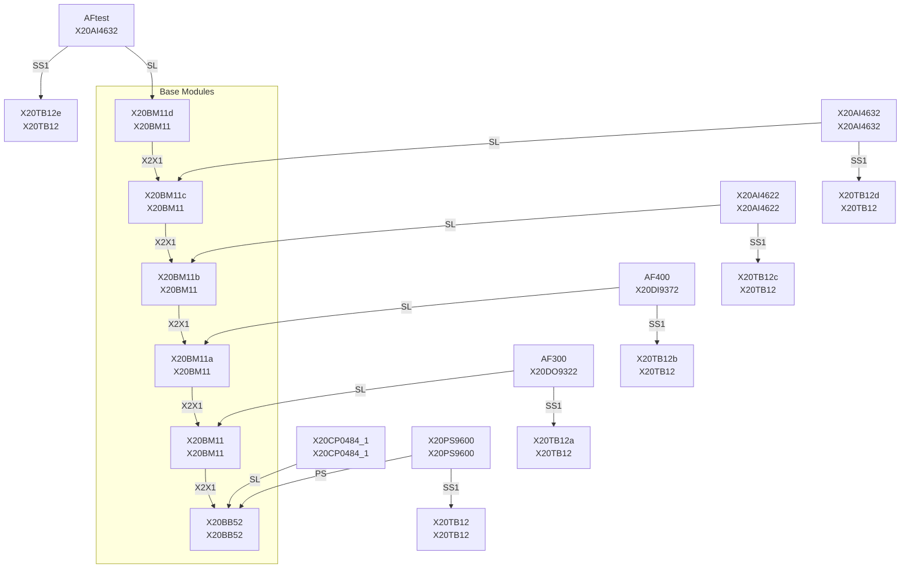
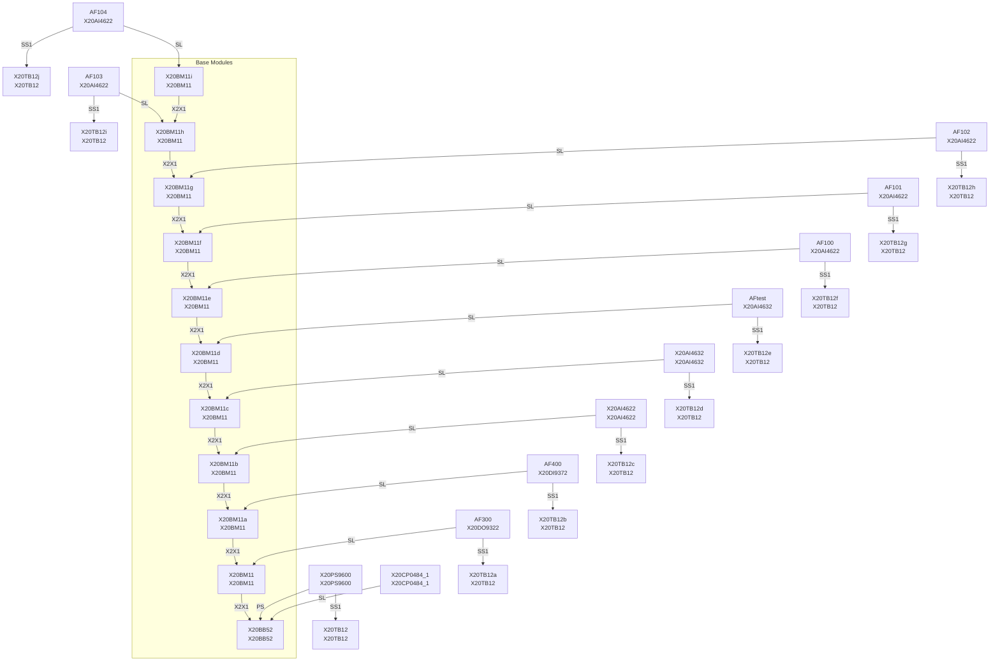
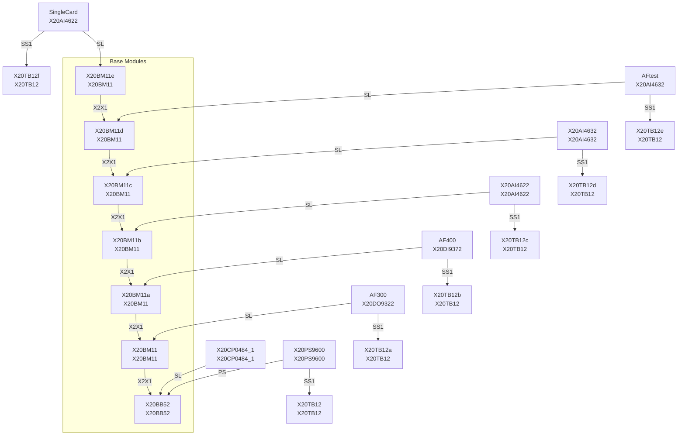
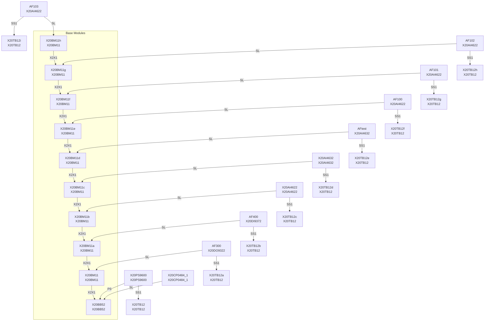
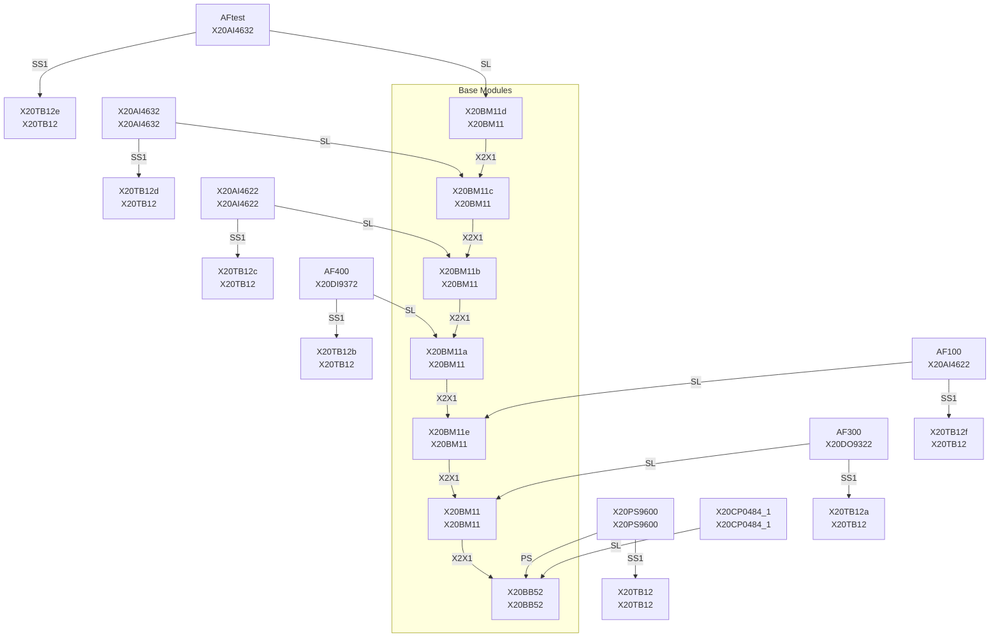

# TreeToMermaid / HwTool

Goals were:

✅ Learning!

✅ Library design.

✅ Learn handling XML files. **For the project i used TinyXML2**

✅ Import HW from CSV and combine to exsisting .hw.  **Works somewhat im very specific cases and with specific cards**

❌ API that is impossible to miss use. **Currenly API is easy to miss use**

❌ Rendering **Bad implementation of the library and time limits didn't allow this**

❌ Tests **Didnt make tests**

TreeToMermaid is a tool for importing, manipulating, and exporting hardware configuration data, with a focus on visualizing module connections as Mermaid diagrams. Project is created with Automation studio in mind. Just barely working and will have alot of unwanted behavior.


### Usage

Importing valid [Hardware.hw](Hardware.hw) and exporting it in mermaid should look like this. Make sure you move hardware.hw or test.csv to the working directory.
```cpp
#include <HwTool.h>
HwTool::Hw hw;
hw.importHW("Hardware.hw")
hw.exportMermaid("Hardware.md")
```




### Working with imported HW


Using getAvailableCards() returns available cards from the currently imported hardware. You must have imported hardware before using getAvailableCards().
```cpp
hw.importHW("hardware.hw");
hw.createCard("testing", cardType::X20AI2622);
std::vector<std::string> validcards = hw.getAvailableCards();
for (size_t i = 0; i < validCards.size(); ++i) {
    std::cout << std::format("[{:>2}] - {}\n", i, validCards[i]);
}
```

```console
[ 0] - AF400
[ 1] - X20CP0484_1
[ 2] - AFtest
[ 3] - AF300
[ 4] - X20AI4632
[ 5] - X20AI4622
```

### Importing from CSV

importCSV returns csv in format that the HwTool can process it.

*HW_version-1.0.0.csv*
```csv
Location,Name,Type
+AK2,AF100,X20DIAI4622
+AK2,AF101,X20DIAI4622
+AK2,AF102,X20DIAI4622
+AK2,AF103,X20DIAI4622
+AK2,AF104,X20DIAI4622
```

```cpp
auto modulesCsv = hw.importCSV("HW_version-1.0.0.csv");

```

### Combining existing hardware.hw with importCSV

Note that the code is buggy and you cannot give target card for comnbineToExisting that isn't the "end of the chain" card. In this [Hardware.hw](Hardware.hw) it is AFtest. So validCards[4] is refering to AFtest.

```cpp
hw.importHW("hardware.hw");
std::vector<std::string> validcards = hw.getAvailableCards();
for (size_t i = 0; i < validCards.size(); ++i) {
    std::cout << std::format("[{:>2}] - {}\n", i, validCards[i]);
}

auto modulesCsv = hw.importCSV("HW_version-1.0.0.csv");
hw.combineToExisting(modulesCsv, validcards[4]);
hw.exportMermaid("HW_version-1.0.0.md");
hw.exportHW("Hw_version1.0.0.0.hw");
```



### Adding single cards to HW


```cpp
hw.importHW("hardware.hw");
hw.exportMermaid("adding_single_card_before.md");
hw.createCard("SingleCard", cardType::X20DI9372);
auto validCards = hw.getAvailableCards();
hw.linkToTarget(validCards[2]);
hw.exportMermaid("adding_single_card_after.md");
```
Before adding: 

After adding:


### Adding multiple cards to HW

```cpp
hw.importHW("hardware.hw");
hw.exportMermaid("before_adding_cards.md");
std::string previousCard = "";
for (size_t i = 0; i < 4; i++)
{
    std::string newCardName = "AF10" + std::to_string(i);
    hw.createCard(newCardName, cardType::X20AI4622);
    if (previousCard.empty()){
        auto validCards2 = hw.getAvailableCards();
        previousCard = validCards2[2];
    }
    
    hw.linkToTarget(previousCard);
    previousCard = newCardName;
}
hw.exportMermaid("after_adding_cards.md");

```

Before adding:


After adding:


### Undo Redo

Going of the previous example. Undoing 3 times will leave just one newly added card "AF100". Mermaid charts sometimes changes the display format. Redo works the same way but to the other direction. Redo and undo is only implemented for createCard currently.

```cpp
    ...
    hw.undo();
    hw.undo();
    hw.undo();

    hw.exportMermaid("after_undo_cards.md");
```



### Exporting HW

After adding cards you can export it back to HW. If the MermaidGraph looks allright it should be valid .hw.

```cpp
auto modulesCsv = hw.importCSV("HW_version-1.0.0.csv");
hw.combineToExisting(modulesCsv, validcards5[2]);
hw.exportMermaid("HW_version-1.0.0.md");
hw.exportHW("Hw_version1.0.0.0.hw");
printf("Example done");
```

### LISENCE
MIT